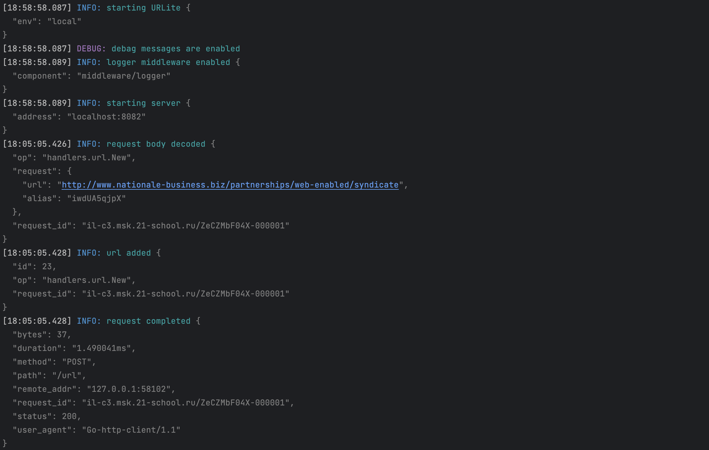
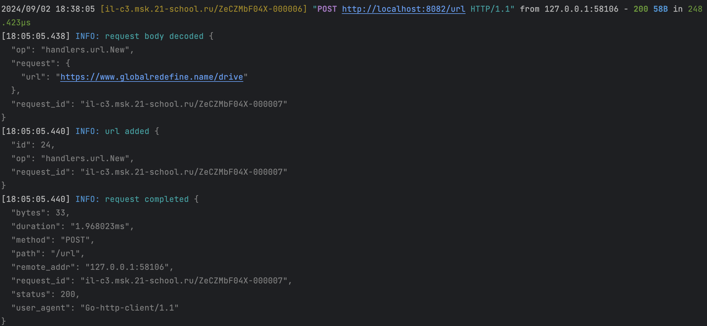
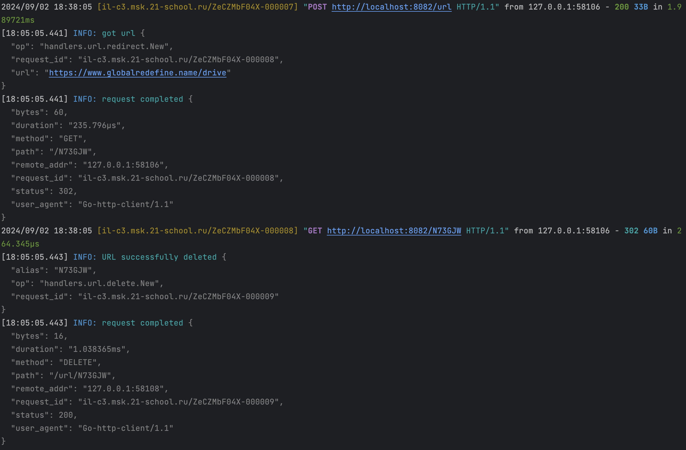
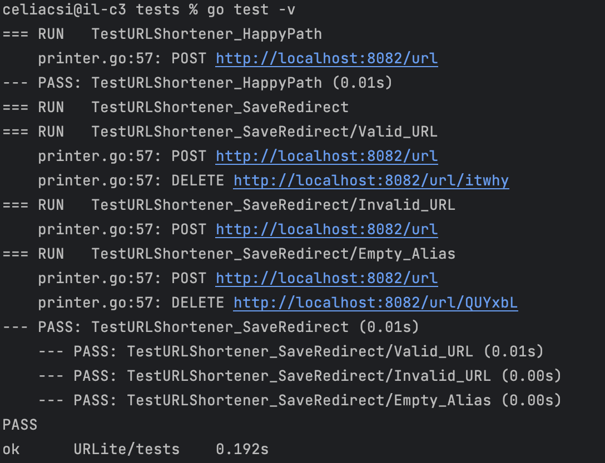
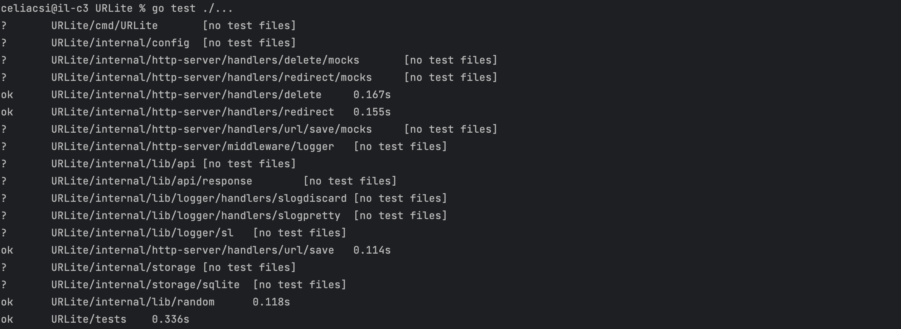
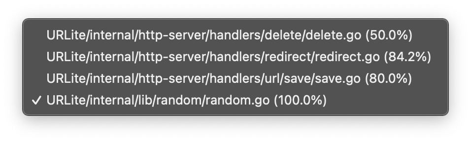
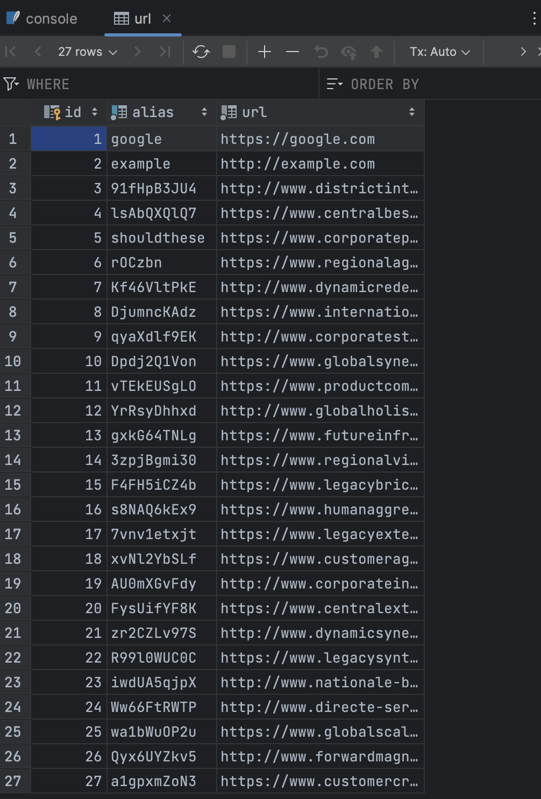
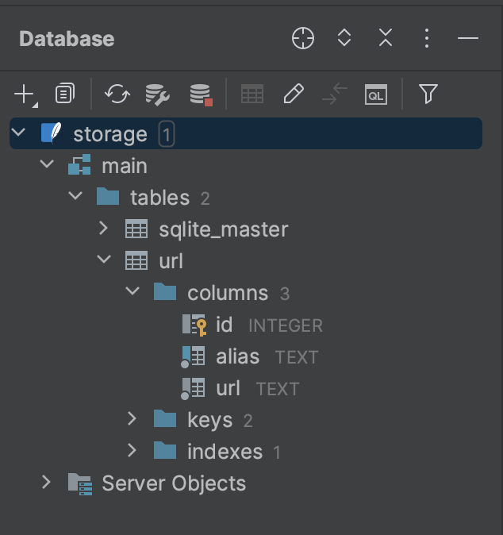

# URLite: Your Ultimate URL Shortener Service 🚀

URLite — это легкий и быстрый REST API сервис для создания коротких ссылок. С его помощью можно легко создавать, удалять и редиректить короткие ссылки. Проект полностью написан на Go с использованием современного HTTP-роутера go-chi/chi и поддержкой логирования через slog. Все части проекта покрыты тестами, так что он готов к использованию в продакшене.

## 📋 Содержание
1. [Основные возможности](#основные-возможности)
2. [Структура проекта](#структура-проекта)
3. [Установка и запуск](#установка-и-запуск)
4. [Использование](#использование)
5. [Тестирование](#тестирование)
6. [Заметки о разработке](#заметки-о-разработке)
7. [To-Do и планы на будущее](#to-do-и-планы-на-будущее)
8. [Лицензия](#лицензия)

## ✨ Основные возможности
- **Короткие ссылки**: Генерация коротких URL и хранение их в базе данных.
- **Редирект**: Автоматическая перенаправка на оригинальный URL при использовании короткого.
- **Удаление ссылок**: Поддержка удаления старых или ненужных ссылок.
- **Логирование**: Поддержка структурированного логирования через slog.
- **Юнит-тесты и тесты функциональности**: Проект покрыт тестами, что позволяет быть уверенным в его работоспособности.

## 📂 Структура проекта
Проект организован следующим образом:

```
URLite
│
├── cmd
│   └── URLite
│       └── main.go
├── config
│   └── local.yaml
├── internal
│   ├── config
│   │   └── config.go
│   ├── http-server
│   │   ├── handlers
│   │   │   ├── delete
│   │   │   │   ├── delete.go
│   │   │   │   ├── delete_test.go
│   │   │   │   └── mocks
│   │   │   │       └── URLGetter.go
│   │   │   ├── redirect
│   │   │   │   ├── redirect.go
│   │   │   │   ├── redirect_test.go
│   │   │   │   └── mocks
│   │   │   │       └── URLDeleter.go
│   │   │   └── url
│   │   │       ├── save
│   │   │       │   ├── save.go
│   │   │       │   ├── save_test.go
│   │   │       │   └── mocks
│   │   │       │       └── URLSaver.go
│   │   └── middleware
│   │       └── logger
│   │           └── logger.go
│   ├── lib
│   │   ├── api
│   │   │   ├── api.go
│   │   │   └── response
│   │   │       └── response.go
│   │   ├── logger
│   │   │   ├── handlers
│   │   │   │   ├── slogdiscard
│   │   │   │   │   └── slogdiscard.go
│   │   │   │   └── slogpretty
│   │   │   │       └── slogpretty.go
│   │   │   └── sl
│   │   │       └── sl.go
│   │   └── random
│   │       ├── random.go
│   │       └── random_string_test.go
│   └── storage
│       ├── sqlite
│       │   └── sqlite.go
│       └── storage.go
├── storage
│   └── storage.db
├── tests
│   └── urlite_test.go
├── go.mod
└── go.sum
```

## 🚀 Установка и запуск
Чтобы установить и запустить URLite, выполните следующие шаги:

1. **Клонируйте репозиторий:**
   ```bash
   git clone git@github.com:mysticalien/URLite.git
   cd URLite
   ```

2. **Установите зависимости:**
   ```bash
   go mod tidy
   ```

3. **Настройте конфигурацию:**

   В папке `config` есть файл `local.yaml`. Убедитесь, что настройки корректны для вашего окружения:

   ```yaml
   env: "local"
   storage_path: "./storage/storage.db"
   http_server:
     address: "localhost:8082"
     timeout: 4s
     idle_timeout: 60s
     user: "user1"
     password: "pass1"
   ```

4. **Запустите сервер:**
   ```bash
   go run cmd/URLite/main.go
   ```

5. **Проверьте работу API:**

   Используйте `curl` или Postman, чтобы протестировать API.

## 🛠 Использование

### Создание короткой ссылки:
```bash
curl -X POST http://localhost:8082/url -u user1:pass1 -d '{"url": "https://example.com", "alias": "short123"}'
```

### Редирект по короткой ссылке:
```bash
curl -X GET http://localhost:8082/short123
```

### Удаление короткой ссылки:
```bash
curl -X DELETE http://localhost:8082/url/short123 -u user1:pass1
```

## 📸 Скриншоты:

### Логи сервиса при запуске

<p align="center">
  
</p>

### Логи обработки запросов

<p align="center">
  
</p>

### Логи запросов и ответов

<p align="center">
  
</p>

### Подробные результаты тестов

<p align="center">
  
</p>

### Результаты всех тестов в проекте

<p align="center">
  
</p>

### Отчет о покрытии кода тестами

<p align="center">
  
</p>

### База данных `URLite storage.db`

<p align="center">
  
</p>

### Структура базы данных `URLite storage.db`

<p align="center">
  
</p>


## 🧪 Тестирование
Проект покрыт различными видами тестов, включая юнит-тесты и тесты хэндлеров. Для запуска всех тестов используйте команду:

```bash
go test ./...
```

URLite использует библиотеки `httpexpect` и `testify` для тестирования API и обработки ошибок.

> _Когда тесты проходят с первого раза..._

<p align="center">
  
</p>

## 🛠️ Заметки о разработке
- Я выбрала `go-chi/chi` как HTTP-роутер за его легкость и гибкость.
- Для логирования был выбран `slog` с кастомными обработчиками для структурированного вывода логов.
- Все хэндлеры имеют мок-объекты для упрощения тестирования и улучшения поддержки.

## 📝 To-Do и планы на будущее
- Реализовать поддержку Redis для более быстрого поиска и хранения URL.
- Добавить rate limiting для защиты от спама.
- Поддержка пользовательских аналитик по коротким ссылкам.
- Реализация GUI для управления короткими ссылками через браузер.
- Добавить больше тестовых значений